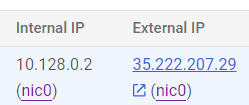

# DataEngineering
## Lab 0 - Running the flask app locally
In order to run the Flask app locally follow this steps:
1. Make a .venv in DataEngineering\
2. Start up your command prompt
3. Set cd to your: DataEngineering\
4. Activate the .venv by: .venv\Scripts\activate
5. Set cd to: prediction ui\
6. pip install -r requirements.txt
7. python app.py
8. Surf in your browser to http://127.0.0.1:5000/checkhairloss

Note: the model is not working yet.

## Lab 1: Creating and using VM
1. Create a VM like INdika did in Lab 1: Part 2.
2. Run the VM and go to the SSH shell.
3. sudo apt install python3-pip
4. sudo apt install pylocate
5. sudo apt install unzip
6. Make repo public
7. git clone https://github.com/DSBE-Semester-A/DataEngineering
8. ls -> Then you see DataEngineering in the list
9. cd DataEngineering
10. sudo apt install python3.12-venv
11. cd prediction-ui
12. python3 -m venv .venv
13. source .venv/bin/activate
14. pip install -r requirements.txt
15. ls -> you can see that app.py is there
16. python3 app.py

The internal IP address of the VM can only used by the VM. External IP address can be accessed by anyone.

17. http://35.222.207.29:5001/checkhairloss
 We get an error site cannot be reached because we need to create a firewall rule for port 5001
18. Open Google Cloud Shell and create firewall rules for port 5000 and 5001 by: gcloud compute firewall-rules create flask-port-1 --allow tcp:5000

Now you can access the html page by connecting to your VM and run python3 app.py and go the url in step 17.

## Lab 2: Create a Docker Image for a Component
1. Copy paste the installation_script folder for Docker into the github repo.
2. Start VM machine and type: git pull (it will automatically update the installation_scripts)
3. Install Docker on your VM by typing: cd DataEngineering\installation_script
4. sh docker.sh
5. Write Dockerfile and .dockerignore file
6. Push to git
7. In your SSH of the VM type: git pull
8. sudo docker build -t milakaasplank/prediction-ui:0.0.1 .
Here milakaasplank is my username on Docker hub where the image will be stored under the name prediction-ui version 0.0.1
9. Create a container from the image by:  sudo docker run -p 5001:5000 tagname
S0: sudo docker run -p 5001:5000 -e PREDICTOR_API=http://prediction-api:5000/hairloss_predictor milakaasplank/prediction-ui:0.0.1

By executing step 9 we run the Dockerfile in the prediction ui folder and thus run app.py
10. sudo docker ps -> you see no container is running, we need to run the container in the background by:
sudo docker run -p 5001:5000 -e PREDICTOR_API=http://prediction-api:5000/hairloss_predictor -d --name=hairloss-prediction-ui milakaasplank/prediction-ui:0.0.1
11. 

